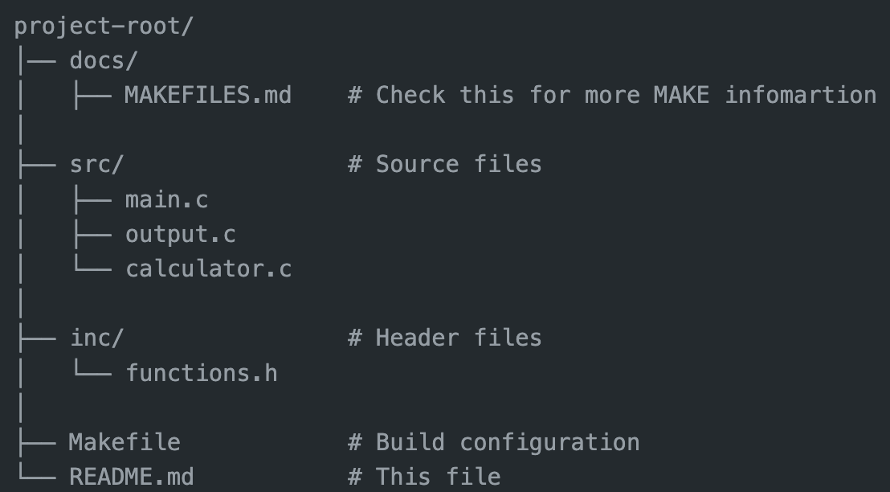

# Description

This project is a simple example of how to use Makefiles to manage the build process for a C program. It includes basic functionality and demonstrates how to compile and link source files into an executable binary.

You do not need an IDE to work with this project; you can manage and build it using the command line. However, if you prefer using an IDE, we recommend [Visual Studio Code (VSCode)](https://code.visualstudio.com/) for its robust support for C programming and its integration with build tools like Make.

## Requirements

* **Compiler**: GCC (GNU Compiler Collection)
* **Make**: GNU Make

### Installation Instructions

#### macOS

To install GCC and Make on macOS, you can use [Homebrew](https://brew.sh/), a package manager for macOS. If you don't have Homebrew installed, follow these steps:

1. **Install Homebrew** (if not already installed):
    ```sh
    /bin/bash -c "$(curl -fsSL https://raw.githubusercontent.com/Homebrew/install/HEAD/install.sh)"
    ```

2. **Install GCC and Make**:
    ```sh
    brew install gcc
    brew install make
    ```

#### Windows

To install GCC and Make on Windows, you can use [MinGW](https://www.mingw-w64.org/) (Minimalist GNU for Windows) or [MSYS2](https://www.msys2.org/).

1. **Install MSYS2**:
    - Download the installer from [MSYS2](https://www.msys2.org/) and follow the instructions on the website.
    - Open the MSYS2 terminal and update the system:
      ```sh
      pacman -Syu
      ```

2. **Install GCC and Make**:
    ```sh
    pacman -S mingw-w64-x86_64-gcc
    pacman -S make
    ```

   Alternatively, if you use MinGW:
    - Download and install the [MinGW Installation Manager](http://mingw.org/wiki/Getting_Started).
    - Open the MinGW Installation Manager and select `mingw32-gcc-g++` and `mingw32-make` to install.

#### Linux

On most Linux distributions, you can install GCC and Make using your distribution's package manager.

- **Debian/Ubuntu**:
    ```sh
    sudo apt update
    sudo apt install build-essential
    ```

- **Fedora**:
    ```sh
    sudo dnf install gcc gcc-c++ make
    ```

- **Arch Linux**:
    ```sh
    sudo pacman -S base-devel
    ```

### Project Structure



### Compilation

To compile the project, navigate to the root directory of the project and run:

    make

This will generate the executable binary named 'main'. If you want to remove all generated files, including object files and the binary, you can run:

    make clean_all

If you only want to remove the object files and keep the binary, use:

    make clean

#### Execution

After compilation, you can run the binary with:

    ./main

#### Notes

* Ensure you have 'gcc' and 'make' installed on your system.
* This project usese a simple Makefile with basic rules. For more complex projects, you may need additional configurations.

#### Additional

This project serves as a basic template to get you started. I encourage you to expand and customize it according to your needs and interests. Feel free to:

- **Add More Functionality**: Implement additional features that you think could enhance the project. This could include new algorithms, additional modules, or any other improvements.
  
- **Create New `.c` and `.h` Files**: As you develop new features, you may find it useful to add more source (`.c`) and header (`.h`) files. Make sure to organize them appropriately within the `src/` and `inc/` directories.

- **Update the Makefile**: If you add new source or header files, remember to update the Makefile to include these changes. This ensures that the build process incorporates your new files and configurations.

- **Test Thoroughly**: As you make changes and add new features, it's important to test the project thoroughly. Ensure that your modifications work as expected and do not introduce new issues.

This project is designed as a starting point, and there is plenty of room for enhancement. Whether you're looking to learn more about C programming, experiment with new ideas, or build something more complex, feel free to adjust and extend the project as you see fit.

Happy coding!
